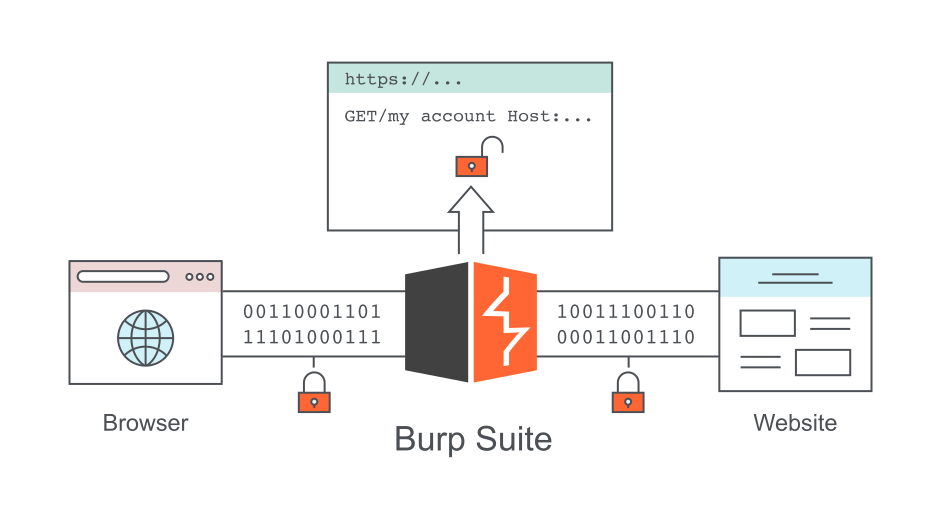

# 动态应用程序安全测试（DAST）

## 什么是DAST安全测试？

动态应用安全测试 (DAST) 从Web应用程序外部测试安全性。一个很好的比喻就是通过攻击银行金库来测试它的安全性。DAST要求安全测试人员对应用的内部结构一无所知。这被称为“黑盒”测试方法，因为测试人员无法看到“盒子”内部。它的目的是模拟真实的攻击。

[Burp Suite](https://portswigger.net/burp)诞生于DAST思维模式。如今，它可以通过其他测试方法来增强和改进其扫描，但它本质上仍然是一个黑盒工具。

## DAST是自动还是手动方法？

答案是“都有”。例如，Burp Suite核心的[自动扫描器](https://portswigger.net/vulnerability-scanner)功能就植根于DAST。但是手动渗透测试也（通常）是DAST，并且需要只有人类才能具备的横向思维。它的很大一部分根本无法自动化。

因此，DAST的范围很广泛，足以包括自动化和手动技术。它只要求你对你要测试的系统的内部一无所知。

## 动态安全测试如何工作？

### 自动化DAST

众所周知，DAST背后的概念是它模仿真实的攻击。就像银行劫匪一样，真正的网络攻击者要做的第一件事就是查明房屋。Burp Suite的扫描器通过“抓取”（crawling）你正在查看的Web应用来模拟这一点。

爬虫是一种机器人，可以自动访问和记录Web应用的每个页面。有了这些内容，它就可以创建地图。考虑到许多现代Web应用程序的动态和易变性，构建爬虫实际上比听起来要复杂得多。

下一步，Burp Suite将审计应用程序的漏洞。这可能涉及任何事情，从使用类似fuzzing（模糊测试）的爆破代码注入技术，到搜索以不安全方式处理用户登录信息的实例。

Burp Suite的自动扫描器能够检测[一长串的安全漏洞](https://portswigger.net/kb/issues)，其中许多实例不会被传统的DAST单独报告。这些增强的能力来自IAST（交互式应用程序安全测试）和[OAST](./2-oast.md)（带外应用程序安全测试）技术的输入。

如果一个组织管理着许多Web应用，或者开发人员正在使用DevSecOps方法，自动DAST扫描将经常连续执行。Burp Suite企业版专为企业安全而设计，[与开发软件无缝集成](https://portswigger.net/developers)并提供极大的可扩展性。

### 手动DAST

没有一个自动化漏洞扫描器能够发现每一个漏洞。虽然自动化软件为渗透测试人员和漏洞赏金猎人节省了大量时间，但在某些情况下，人的创造力和横向思维是不可替代的。

通常，测试人员会先使用自动化的DAST解决方案，以收获“唾手可得的果实”。这种方法为他们腾出额外的时间来处理更加有趣的漏洞。这就是为什么除了Burp Scanner之外，[Burp Suite专业版](https://portswigger.net/burp/pro)还包含一个强大的截断代理，专为手动Web安全测试人员的需求量身定制。

截断代理是一个相当简单的概念。就Burp Suite而言，它意味着一个软件来拦截测试者的浏览器和他们的目标Web应用程序之间的所有HTTP流量。Burp Suite甚至会对HTTPS（加密）流量执行此操作。读取Web应用程序和浏览器之间发送的所有通信的能力在DAST背景下是无价的。

使用截断代理方法，测试人员可以更改浏览器发送到服务器的响应，为探索漏洞提供了大量机会。这就是Burp Suite Pro获得道德黑客瑞士军刀的声誉，并成为行业标准渗透测试软件的原因之一。

## DAST方法的优势

### 准确性

DAST的概念在许多方面都具有优势的，并且通常比替代的类似SAST（静态应用程序安全测试）的“白盒”方法更实用。SAST调查应用程序的源代码以查找漏洞，虽然这在理论上是一个好主意，但在实践中它往往会报告许多误报。DAST就不存在这种倾向。

这并不是说DAST永远不会报告误报，因为这种情况确实时有发生。但是，与SAST相比，返回的数量是可以忽略不计的。就误报而言，这是DAST的一个巨大胜利。误报既浪费时间又浪费金钱。

### 适应性

在适应性方面，DAST与SAST相比也更胜一筹。SAST在这方面受到了影响，因为它依赖于能够读取给定的编程语言才能发挥作用。但由于DAST在设计上与语言无关，所以它不需要像SAST那样对不同类型的代码进行多次实现。

现代Web应用程序很复杂，并且倾向于使用多个框架和抽象层。在这种情况下，一个不可知论方法（agnostic approach[1]）是一个巨大的优势。更不用说几乎不断的更新意味着编程语言经常发生变化。使用DAST，你知道你的扫描器始终为此做好准备。一种尺寸很简单地适合所有人。

如果你有许多Web应用程序要扫描，DAST的不可知论方法也将带来好处。由于其可扩展性，[Burp Suite 企业版](https://portswigger.net/burp/enterprise)被拥有数万个实时应用程序的组织所使用。然后，这些用户可以自由地以他们选择的任何语言开发应用程序。

### 可增强的测试

这并不是说SAST是无用的：远非如此。但在现实世界的场景中，我们相信DAST是更优越的基础方法。而DAST的优越性只有通过Burp Suite专业版和Burp Suite企业版中包含的额外测试方法来增强。

请参阅下面的讨论，了解OAST等方法如何帮助消除DAST概念中固有的一些缺点。

## DAST方法有什么缺点吗？

### Blind和异步的漏洞

没有任何测试方法是完美的，在某些领域，DAST的性能并不太理想。例如，单独使用它会错过许多Blind和异步漏洞。这些涉及应用程序容易受到攻击，但在发送攻击后没有给出明显不同响应的情况。

但通过将DAST与OAST一起部署，这个问题在很大程度上得到了解决。OAST是PortSwigger与Burp Collaborator共同开创的一项技术，并完全集成到为Burp Suite提供支持的漏洞扫描程序包中。

### 非暴露的输入

在涉及未公开的应用程序输入时，也存在类似的情况。DAST不会识别此类漏洞，因为它只能看到来自Web应用程序外部的东西。当然，真正的攻击者在这里也会处于同样的位置。

在Burp Suite的案例中，这个缺点可以通过使用扩展功能得到一定程度的缓解。例如，[Param Miner](https://portswigger.net/bappstore/17d2949a985c4b7ca092728dba871943)可以大大增强Burp Suite专业版在未公开输入的情况下的暴力破解能力。但在这一领域，一个经验丰富的渗透测试人员的直觉对于推断应用程序如何工作的也是非常宝贵的。

### 难以执行的路径

在某些输入路径难以执行的情况下，DAST可能会错过一些漏洞。一个例子是，一个高级漏洞利用，它依赖于多个输入变量的组合才能工作。虽然SAST方法应该会发现这一点，就像一个好的手动渗透测试者一样，但单独的DAST扫描不会。

这里的权衡是，虽然SAST可能会报告这个漏洞，但它往往会作为一长串误报的一部分返回。然后，这就需要测试人员手动审查代码以找到真正的漏洞。这远远不够理想。审查代码的成本很高的，实际上你可能会发现SAST工具给出的常规警报被简单地忽略了。

## DAST是适合你的方法吗？

PortSwigger是Burp Suite的制造商，它是一个DAST工具。我们认为它是许多场景的最佳解决方案，它包含世界上使用最广泛的漏洞扫描程序。但它适合你吗？

首先，我们应该指出，没有任何一种自动化方法可以完全替代手动渗透测试。有一些漏洞是需要人去发现的。因此，网络安全合规标准通常包括对渗透测试和漏洞扫描的要求。

像Burp Suite这样的自动化DAST扫描器可以帮助你保护你的在线资产，无论你管理的是多个应用程序，还是只管理几个应用程序。它可以从开发阶段开始，一直到部署及以后。如果你是一名渗透测试人员，你会喜欢Burp Suite Pro的高级手动工具如何帮助你达到新的高度。

如果你有兴趣了解有关[Burp Suite](https://portswigger.net/burp)的更多信息，并想知道它如何适合你的使用场景，请查看以下资源：

https://portswigger.net/customers

> 译者注：
>
> [1] agnostic approach翻译为不可知论方法。在基于计算机的环境中，不可知论方法是跨系统可互操作的方法，并且对使用特定技术、模型、方法或数据没有偏见。
