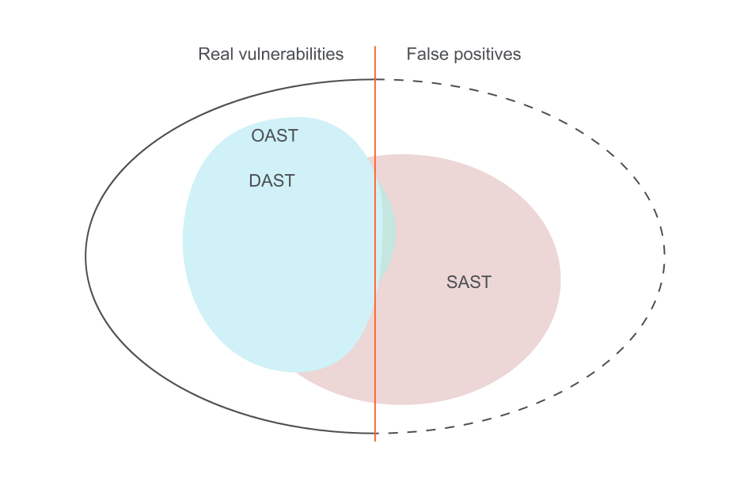

# 带外应用程序安全测试（OAST）

## 什么是OAST安全测试？

带外应用程序安全测试（OAST）利用外部服务器来查看其他不可见的漏洞。它的出现是为了进一步改进DAST（动态应用程序安全测试）模型。PortSwigger通过Burp Collaborator成为了OAST的先驱者。将OAST功能添加到Burp Suite中，使该方法更易于获得。

## OAST测试有什么其他方法无法做到的？

一个Web应用可能包含任意数量的安全漏洞。其中许多漏洞广为人知，但在新旧软件中都会定期发现漏洞。更复杂的是，Web应用程序，以及它们所使用的编码语言，往往处于持续开发之中。没有什么东西可以长时间保持不变。

这种动态性质的情况使事情变得很棘手。这意味着，无论怎样的测试，无论怎样的技术组合，都不可能找到一个应用程序中的每一个潜在漏洞。即便能做到，这种情况也不会持续太久。安全专业人员与网络犯罪分子不断竞争，失败的后果可能是毁灭性的。

### 隐形漏洞 - DAST

DAST的主要卖点一直是它能产生非常高质量的结果。如果你正在浏览用这种方法生成的报告，那么几乎可以肯定你看到的是实际的漏洞。这些信息可以直接交给你的开发团队进行修复。

但是当单独使用时，动态测试很难检测到某些类型的安全漏洞。例如，很容易错过Blind和异步漏洞。正如你将在下面看到的，使用OAST增强动态测试，对于解决此问题大有帮助。

### 误报 - SAST

SAST（静态应用程序安全测试）是另一种常见的安全测试方法。它有效地采用了动态测试相反的方法。DAST从外部考虑一个应用程序，而SAST则着眼于代码本身。这种方法给它带来了一系列不同的好处和弊端。

这里的主要问题是，因为SAST实际上并没有执行任何代码，它只能看到“可能”发生的事情。这意味着，在一般情况下，SAST将产生比DAST更大、更有噪音的结果集。这种噪音以误报的形式出现。其中包括真正的漏洞，但确定哪些是漏洞需要花费时间和金钱。

## OAST是如何工作的？

OAST改善了DAST安全测试所得到的结果。在许多方面，它本身就是一种动态的方法，尽管它可以看到“拐角处”（around corners）。这是因为“动态应用程序安全测试”实际上只是表示无法看到应用程序内部运作的测试。这也可以作为OAST的描述。

### 从外部进攻

传统的动态测试在其简单性上是优雅的。从本质上讲，它将有效载荷（payload[1]）发送到目标应用程序并分析返回的响应，就像真正的攻击者一样。

当你发送一个DAST payload，并且你的目标返回给你一个表明存在漏洞的响应时，你可以很肯定它是真实的。动态测试之所以取得这样的成功，是因为它在这些情况下运作良好。

但是，如果一个目标应用程序没有对payload返回响应，即使该目标实际上是存在漏洞的，该怎么办？当一个应用程序是异步工作时，这是一个特别的问题。仅靠传统的DAST技术是看不到它的。

### 看到地平线

这就是OAST的用武之地。当PortSwigger推出Burp Collaborator时，OAST是该领域的一个革命性的补充。它使Burp Suite能够检测到大量新的漏洞，包括许多[blind SQL注入]()、blind[跨站脚本]()和blind[操作系统命令注入]()漏洞。

Burp Collaborator通过在动态测试过程中引入一个新的通信渠道来执行OAST。

那么，这里到底发生了什么？好吧，正如我们上面提到的，Burp Collaborator可以搜索大量的漏洞，而这些漏洞在DAST测试中曾是看不见的。

如果一个漏洞是blind的，那么当我们发送测试攻击时，它不会向我们返回任何有用的响应，即使该攻击是成功的。我们需要一种方法来绕过这一点。带外测试方法就是这种绕过方法。它是通过发送一个攻击payload来完成的，该payload会导致目标与我们控制的外部系统进行交互，该外部系统位于目标域之外。

### OAST的简单方法

有了Burp Collaborator，这很容易做到，即使你没有控制一个外部系统来用于这个目的。Burp Suite企业版和Burp Suite专业版都可以与Burp Collaborator服务器通信，以达到测试的目的。如果你愿意，你还可以随时配置私人服务器来做同样的事情。

Burp Collaborator可以准确识别负责它所收到的每个交互的Burp Scanner payload。因此，如果某个目标返回了有用的信息，你将确切地知道是什么触发了它。这个过程主要是为了自动化而设计的，它位于Burp Scanner内部。对于高级用户，Burp Suite专业版还包括手动OAST工具。

## 带外测试的优势

正如你可能看到的，自动化OAST是一种强大的技术，可以添加到安全测试人员的武器库中。上面的维恩图显示了OAST如何大大增加了DAST可以识别的安全问题的数量。其中一些也可能被SAST工具发现，但在许多情况下，这不太可能。

OAST具有与传统动态测试相同的优势。它很少产生误报，这意味着它的报告是可信赖的。

与DAST一样，OAST对应用程序所编写的语言是不可知的。即使你想扫描多个Web应用程序，也不需要多个软件。这与Burp Suite企业版的巨大可扩展性相得益彰。你的整个网络组合现在可以由一个软件来进行扫描。

## OAST测试有什么缺点吗？

如果说OAST使测试变得完美，那就是在撒谎。没有任何方法是完美的。总会有DAST和OAST看不到的漏洞，就像SAST会漏掉其他漏洞一样。

自动化Web安全扫描并不是解决安全漏洞的灵丹妙药。它应始终与定期的人工手动渗透测试结合使用。这种方法将有助于保持你的网站既安全又合规。

PortSwigger在推出Burp Collaborator时是OAST测试的先驱。这一功能集成在Burp Suite企业版和Burp Suite专业版中。关于Burp Suite的更多信息，以及它如何适合你的特定使用场景，请看下面的资源：

https://portswigger.net/customers

> 译者注：
>
> [1] payload，中文译作有效载荷或攻击载荷。此词后续一律不翻译。