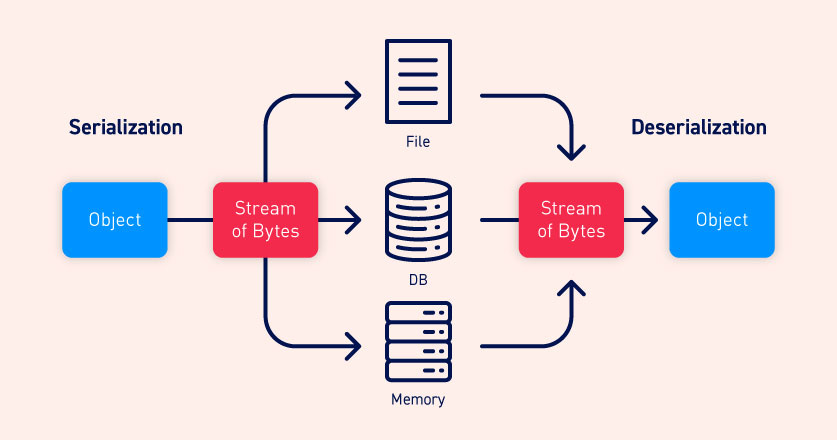

# 不安全的反序列化

在本节中，我们将介绍什么是不安全的反序列化，并描述它如何使网站有可能受到高严重性的攻击。我们将使用PHP、Ruby和Java反序列化的具体示例重点介绍典型的场景，并演示一些广泛适用的技术。还将探讨一些方法，让你在自己的网站上避免不安全的反序列化漏洞。

> **实验**
>
> 如果你已经熟悉反序列化漏洞背后的基本概念，只想在一些现实的、故意易受攻击的目标上练习利用它们，可以从下面的链接中访问本主题中的所有实验。
>
> [查看所有反序列化漏洞](https://portswigger.net/web-security/all-labs#insecure-deserialization)

## 什么是序列化？

**序列化**是将复杂的数据结构（例如对象及其字段）转换为“更扁平”的格式，可以作为连续的字节流发送和接收的过程。对数据进行序列化使以下操作变得更加简单：

- 将复杂的数据写入进程间内存、文件或数据库中
- 发送复杂的数据，例如，通过网络，在一个应用程序的不同组件之间，或在一个API调用中

至关重要的是，当序列化一个对象时，它的状态也会被持久化。换句话说，对象的属性以及它们的赋值都会被保留下来。

### 序列化与反序列化

**反序列化**是将字节流还原为原始对象的完整功能副本的过程，其状态与序列化时的状态完全相同。然后，网站的一些逻辑便可以与此反序列化的对象进行交互，就像与任何其他对象进行交互一样。

许多编程语言为序列化提供了原生的支持。对象的具体序列化方式取决于具体的语言。一些语言将对象序列化为二进制格式，而另一些语言则使用不同的字符串格式，同时具有不同程度的人类可读性。请注意，所有原始对象的属性都存储在序列化的数据流中，包括任何私有字段。为防止字段被序列化，必须在类声明中明确将其标记为“transient”。

请注意，在使用不同的编程语言时，序列化可能被称为marshalling（Ruby）或pickling（Python）。这些术语在这里与”序列化“同义。

## 什么是不安全的反序列化？

不安全的反序列化是指用户可控的数据被网站反序列化。这可能使攻击者能够操纵序列化对象，以便将有害数据传递到应用程序代码中。

甚至有可能用一个完全不同类的对象来替换一个序列化的对象。令人震惊的是，网站可用的任何类的对象都会被反序列化和实例化，无论预期的是哪个类。因此，不安全的反序列化有时被称为“对象注入”漏洞。

一个非预期的类的对象可能会引发一个异常。然而，到此时损害可能已经造成了。许多基于反序列化的攻击是在反序列化完成**之前**完成的。这意味着，即使网站自身的功能没有与恶意对象直接交互，反序列化过程本身也可以发起攻击。出于这个原因，那些逻辑基于强类型语言的网站也可能会受到这些技术的攻击。

## 不安全的反序列化漏洞是如何产生的？

不安全的反序列化通常是由于对反序列化用户可控数据的危险性普遍缺乏了解而产生的。理想情况下，用户输入的数据根本就不应该被反序列化。

然而，有时网站所有者认为他们是安全的，因为他们对反序列化的数据实现了某种形式的额外检查。这种方法通常是无效的，因为几乎不可能实现验证或清理来考虑所有可能发生的情况。这些检查也存在根本性的缺陷，因为它们依赖于在反序列化后检查数据，在许多情况下，这对于阻止攻击来说为时已晚。

由于反序列化的对象通常被认为是可信赖的，因此也可能出现漏洞。特别是在使用具有二进制序列化格式的语言时，开发人员可能会认为用户无法有效地读取或操作数据。然而，虽然可能需要更多的努力，但攻击者利用二进制序列化对象和利用基于字符串的格式是一样的。

由于现代网站存在大量的依赖关系，基于反序列化的攻击也成为可能。一个典型的网站可能会实现许多不同的库，这些库也都有自己的依赖关系。这就形成了一个难以安全管理的庞大的类和方法库。由于攻击者可以创建任何这些类的实例，因此很难预测哪些方法可以在恶意数据上被调用。如果攻击者能够将一长串未预期的方法调用连在一起，将数据传入到与初始来源完全无关的接受器中，情况就更是如此。因此，几乎不可能预测到恶意数据的流动并堵住每一个潜在的漏洞。

简而言之，可以说不可能安全地反序列化不受信任的输入。

## 不安全的反序列化有什么影响？

不安全的反序列化的影响可能非常严重，因为它为大量增加的攻击面提供了一个入口点。它允许攻击者以有害的方式重用现有的应用程序代码，从而导致许多其他漏洞，通常是远程代码执行。

即使在无法远程执行代码的情况下，不安全的反序列化也可能导致权限提升、任意文件访问和拒绝服务攻击。

## 如何利用不安全的反序列化漏洞

现在你已经熟悉了序列化和反序列化的基础知识，我们可以看看如何利用不安全的反序列化漏洞。

> **阅读更多**
>
> [利用不安全的反序列化漏洞](./exploiting.md)

## 如何防范不安全的反序列化漏洞

一般来说，除非绝对必要，否则应避免对用户输入进行反序列化。在许多情况下，它可能带来的高严重性的漏洞，以及对它们进行保护的困难，都超过了它的好处。

如果你确实需要对来自不受信任来源的数据进行反序列化，请采用可靠的措施以确保数据没有被篡改。例如，可以实现一个数字签名来检查数据的完整性。但是请记住，任何检查必须在开始反序列化过程**之前**进行。否则，它们就没有什么用处。

如果可能，应该完全避免使用通用的反序列化功能。这些方法的序列化数据包含原始对象的所有属性，包括可能包含敏感信息的私有字段。相反，你可以创建自己的类专用序列化方法，这样至少可以控制哪些字段被暴露。

最后，请记住漏洞是用户输入的反序列化，而不是存在后续处理数据的gadget链。不要依赖于试图消除在测试期间识别的gadget链。由于你的网站上肯定存在Web的跨库依赖关系，因此试图把它们全部堵住是不切实际的。在任何时候，公开记录的内存损坏漏洞也是一个因素，这意味着你的应用程序无论如何都可能容易受到攻击。