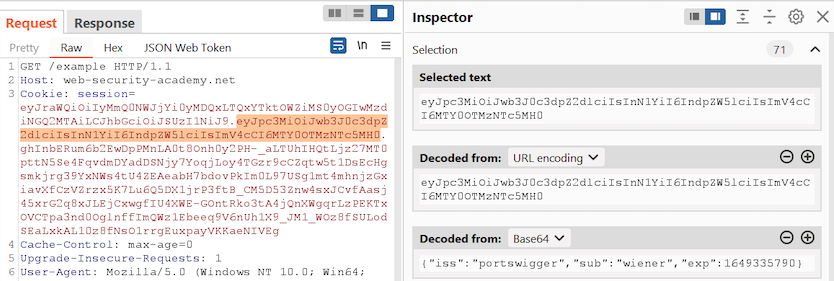
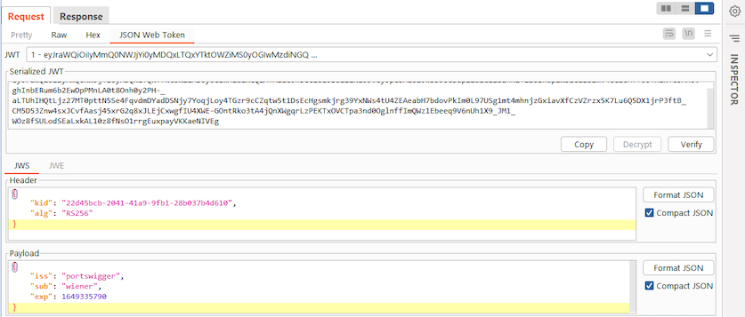
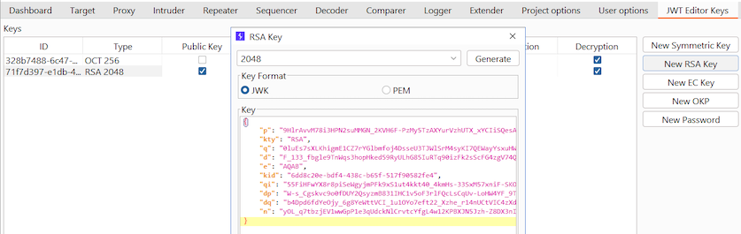
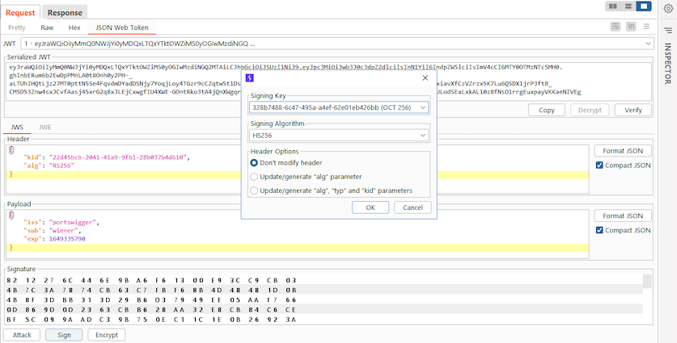

# 在Burp Suite中使用JWT

在本节中，我们将了解如何使用Burp Suite来测试存在漏洞的JWT实现。你也可以通过我们故意设计的存在漏洞的交互式[实验](https://portswigger.net/web-security/all-labs#jwt)来练习使用这些功能。

根据你想要达到的目的，也许可以使用Burp的内置功能。但是我们建议安装[JWT Editor](https://portswigger.net/bappstore/26aaa5ded2f74beea19e2ed8345a93dd)扩展，该扩展可从BApp Store获得。它提供了许多有用的功能，可以更容易地使用JWT并执行更复杂的攻击。这些功能包括：

- 自动高亮显示代理历史记录中包含JWT的请求。
- 一个附加选项卡，可让你生成或上传各种格式的加密密钥。
- 一个附加的信息编辑器选项卡，可让你查看和编辑原始未编码JSON中的JWT标头和有效负载。
- 直接在Burp Repeater中对修改后的JWT进行签名的功能。

## 查看JWT的内容

如果你只想以原始JSON格式查看JWT的内容，只需在报文编辑器中选择令牌的标头或有效负载部分。然后，可以在**Inspector**面板中查看自动解码的值。

> **注意**
>
> 不幸的是，Inspector目前无法同时解码标头和有效负载。你需要选择其中之一。

## 编辑JWT的内容

编辑JWT时，我们建议使用JWT Editor扩展。加载该扩展后，只需在Burp Repeater中打开一个包含JWT的请求，然后切换到扩展生成的**JSON Web Token**信息编辑器选项卡。

然后你可以使用相应的**Header**和**Payload**字段来编辑JSON数据。

> **注意**
>
> 也可以使用Inspector进行类似的修改。但是，这仅适用于你能够完全绕过签名验证的情况。该扩展提供了在你修改令牌后重新签名令牌的附加功能。

## 添加新的签名密钥

在大多数情况下，修改JWT后，需要使用正确的密钥对其重新签名，以便签名与标头和有效负载中的新值一致。为简单起见，建议在此过程中使用JWT Editor扩展。

JWT Editor扩展使用你添加到其密钥库中的密钥来对令牌进行签名。可以上传已经获得的密钥，也可以使用内置功能生成一个全新的密钥。

添加一个新密钥到JWT Editor的密钥库：

1. 在Burp的主选项卡栏中切换到扩展生成的**JWT Editor Keys**选项卡。
2. 在屏幕右侧，单击想要添加的密钥类型的相关按钮，如**New RSA Key**。
3. 在对话框中，有以下选项：
   - 单击**Generate**以自动创建一个选定长度的全新密钥。
   - 粘贴一个现有密钥。根据密钥的类型，可以在JWK和PEM表示形式之间切换。这也提供了一个在两种格式之间转换的简单方法。
4. 单击**OK**。密钥被保存到扩展的密钥库中，可以从**JWT Editor Keys**选项卡访问它。

将密钥添加到密钥库后，就可以在Burp Repeater中使用它们来签名JWT。另外也可以通过右键单击它们并选择相关格式，将其复制到剪贴板。

## 签名JWT

使用JWT Editor扩展签名JWT：

1. 在扩展的密钥库中添加一个合适的密钥。
2. 在Burp Repeater中，使用**JSON Web Token**信息编辑器选项卡来修改JWT标头和有效负载。
3. 在屏幕底部，单击**Sign**。
4. 在对话框中，从扩展的密钥库中选择相关的签名密钥。
5. 如有必要，请选择要使用的签名算法。这通常会根据选择的密钥类型自动更新，但你可能希望在执行算法混淆攻击时对其进行修改。你还可以选择自动更新一些JWT标头。
6. 单击**OK**。请求中的JWT将被替换为你修改过的JWT。

> **实验**

你可以通过完成我们的[交互式JWT实验](https://portswigger.net/web-security/jwt)来练习使用这些功能。