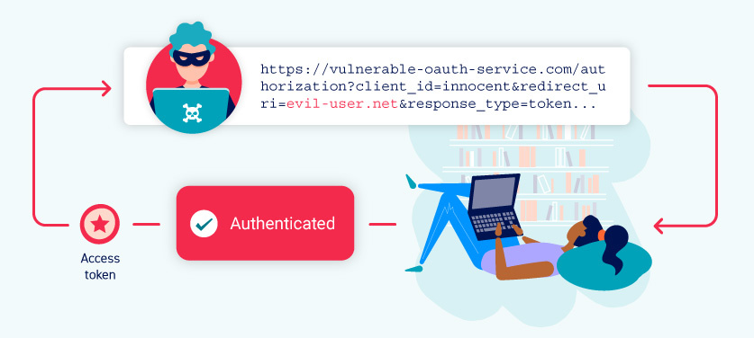

# OAuth 2.0认证漏洞

在浏览网页时，你肯定遇到过让你使用社交媒体账户登录的网站。该功能很有可能是使用流行的OAuth 2.0框架构建的。OAuth 2.0对于攻击者来说是非常有趣的，因为它非常常见，而且在本质上容易出现实现错误。这可能导致许多漏洞，使攻击者能够获取敏感的用户数据，并有可能完全绕过认证。

在本节中，我们将教你如何识别和利用OAuth 2.0认证机制中的一些关键漏洞。如果你对OAuth认证不太熟悉，也不用担心，我们已经提供了大量的背景信息，帮助你理解所需要的关键概念。我们还将探讨OAuth的OpenID Connect扩展中的一些漏洞。最后，我们还提供了一些关于如何保护自己的应用程序免受此类攻击的指南。

本专题是与PortSwigger Research合作撰写的，同时还有[《隐藏OAuth攻击向量》](https://portswigger.net/research/hidden-oauth-attack-vectors)一文。



> **实验**
>
> 如果你已经熟悉了OAuth漏洞背后的基本概念，只想在一些现实的、故意易受攻击的目标上练习利用这些漏洞，可以从下面的链接中访问本专题中的所有实验。
>
> [查看所有OAuth实验](https://portswigger.net/web-security/all-labs#oauth-authentication)

## OAuth是什么？

OAuth是一个常用的授权框架，它允许网站和Web应用能够请求对另一个应用的用户账户进行有限的访问。至关重要的是，OAuth允许用户授权此访问权限，而无需将其登录凭据暴露给请求的应用。这意味着用户可以微调他们想要共享的数据，而不必将帐户的完全控制权交给第三方。

基本的OAuth流程被广泛用于集成第三方功能中，这些功能需要从用户账户访问某些数据。例如，一个应用程序可能会使用OAuth来请求访问你的电子邮件联系人列表，以便它可以建议人们进行联系。然而，同样的机制也被用来提供第三方认证服务，允许用户用他们在不同网站上拥有的账户进行登录。

> **注意**
>
> 虽然OAuth 2.0是目前的标准，但有些网站仍然使用遗留的1a版本。OAuth 2.0是从头开始编写的，而不是基于OAuth 1.0开发的。因此，两者有很大的不同。请注意，在这些材料中，“OAuth”一词专指OAuth 2.0。

## OAuth 2.0是如何工作的？

最初开发OAuth 2.0是为了在应用之间共享对特定数据的访问。它通过在三个不同方（即客户端应用、资源所有者和OAuth服务提供者）之间定义一系列交互来工作。

* **客户端应用**：想要访问用户数据的网站或Web应用。 
* **资源所有者**：客户端应用想要访问其数据的用户。 
* **OAuth服务提供商**：控制用户数据和访问数据的网站或应用。它们通过提供用于与授权服务器和资源服务器交互的API来支持OAuth。

实际的OAuth流程可以有许多不同的实现方式。这些被称为OAuth“流”（flows）或“授权类型”（grant types）。在本专题中，我们将重点关注“授权码”（authorization code）和“隐式”（implicit）授权类型，因为它们是目前为止最常见的类型。一般来说，这两种授权类型都涉及以下阶段：

1. 客户端应用请求访问用户的数据子集，指定他们想要使用的授权类型以及想要的访问类型。 
2. 用户将被提示登录到OAuth服务，并明确地对所请求的访问表示同意。 
3. 客户端应用会收到一个唯一的访问令牌，该令牌证明他们有权从用户那里访问请求的数据。具体如何发生取决于授权类型。 
4. 客户端应用使用该访问令牌来进行API调用，从资源服务器获取相关数据。

在学习如何使用OAuth用于认证之前，了解基本的OAuth流程的基础原理非常重要。如果你对OAuth完全陌生，我们建议在进一步阅读之前，先熟悉一下我们将要介绍的两种授权类型的细节。

> **阅读更多**
>
> [OAuth授权类型](./grant-types.md)

## OAuth认证

尽管OAuth最初并不是为了此目的而设计的，但它已经演变成为一种验证用户的手段。例如，你可能对许多网站提供的选项很熟悉，即使用你现有的社交媒体账户登录，而不必在相关网站注册。每当看到这个选项，很有可能它就是基于OAuth 2.0构建的。

对于OAuth认证机制，基本的OAuth流在很大程度上是相同的；主要的区别在于客户端应用如何使用它所收到的数据。从最终用户的角度来看，OAuth认证的结果大致类似于基于SAML的单点登录（SSO）。在这些材料中，我们将专门关注这种类似SSO用例中的漏洞。

OAuth认证的实现方式一般如下：

1. 用户选择用他们的社交媒体账户登录。然后，客户端应用使用社交媒体网站的OAuth服务，请求访问一些可以用来识别用户的数据。例如，这可能是他们账户中注册的电子邮件地址。
2. 在收到访问令牌后，客户端应用从资源服务器请求这些数据，通常是从一个专门的`/userinfo`端点。
3. 一旦收到这些数据，客户端应用就会用它代替用户名来让用户登录。它从授权服务器上收到的访问令牌通常被用来代替传统的密码。

你可以在下面的实验中看到一个简单的实例。只要在通过Burp代理流量时完成“Log in with social media”选项，然后研究Burp代理历史中的一系列OAuth交互。可以使用凭证`wiener:peter`来登录。请注意，这种实现方式是故意存在漏洞的，我们将在后面教你如何利用这一点。

> **实验**：[通过OAuth隐式流来绕过认证](https://portswigger.net/web-security/oauth/lab-oauth-authentication-bypass-via-oauth-implicit-flow)

## OAuth认证漏洞是如何产生的？

OAuth认证漏洞的出现，部分原因是OAuth规范在设计上相对模糊和灵活。虽然每一种授权类型的基本功能都需要一些强制性的组件，但绝大多数的实现都是完全可选的。这包括许多为保证用户数据安全所必需的配置设置。简而言之，糟糕的做法有很多机会潜入。

OAuth的另一个关键问题是普遍缺乏内置的安全功能。安全性几乎完全依赖于开发人员使用正确的配置选项组合，并在上面实现他们自己额外的安全措施，如健壮的输入验证。正如你可能已经了解到的，有很多东西需要理解，如果对OAuth缺乏经验，这很容易出错。

根据授权类型，高度敏感的数据还会通过浏览器发送，这为攻击者提供了各种拦截的机会。

## 识别OAuth认证

识别一个应用是否使用了OAuth认证是相对简单的。如果看到使用从其他网站上你的账户登录的选项，这是一个强有力的迹象，表明OAuth正在被使用。

识别OAuth认证最可靠的方法是通过Burp代理你的流量，并在使用这个登录选项时检查相应的HTTP消息。无论使用的是哪种OAuth授权类型，流的第一个请求都是对`/authorization`端点的请求，其中包含一些专门用于OAuth的查询参数。特别是要注意`client_id`、`redirect_uri`和`response_type`参数。例如，一个授权请求通常看起来会像这样：

```http
GET /authorization?client_id=12345&redirect_uri=https://client-app.com/callback&response_type=token&scope=openid%20profile&state=ae13d489bd00e3c24 HTTP/1.1
Host: oauth-authorization-server.com
```

## 侦察

对正在使用的OAuth服务做一些基本的侦察，可以在识别漏洞时为你指明正确的方向。

不言而喻，你应该研究构成OAuth流的各种HTTP交互，我们将在后面讨论一些具体的东西。如果使用的是外部OAuth服务，应该能够从授权请求所发的主机名中识别出具体的提供商。由于这些服务提供了公共的API，通常会有详细的文档可以告诉你各种有用的信息，例如端点的确切名称和正在使用的配置选项。

一旦你知道了授权服务器的主机名，就应该尝试向如下标准端点发送`GET`请求：

* `/.well-known/oauth-authorization-server`
* `/.well-known/openid-configuration`

这些通常会返回一个包含关键信息的JSON配置文件，例如可能支持的额外功能的细节。这有时会提示你一个更广泛的攻击面和支持的功能，这些功能可能在文档中没有提到。

## OAuth认证漏洞利用

漏洞可能出现在客户端应用的OAuth实现中，也可能出现在OAuth服务本身的配置中。在本节中，我们将向你展示，如何在这两种情况下利用一些最常见的漏洞。

* 客户端应用中的漏洞
  * [隐式授权类型的不正确实现](#隐式授权类型的不正确实现)
  * [有缺陷的CSRF保护](#有缺陷的CSRF保护)
* OAuth服务中的漏洞
  * [泄露授权码和访问令牌](#泄露授权码和访问令牌)
  * [有缺陷的作用域验证](#有缺陷的作用域验证)
  * [未经验证的用户注册](#未经验证的用户注册)

### 客户端应用中的漏洞

客户端应用通常会使用一个知名的、经过实战考验的OAuth服务，该服务可以很好地防止众所周知的漏洞。然而，其自身方面的实现可能不太安全。

正如我们已经提到的，OAuth规范的定义是相对宽松的。这一点在客户端应用的实现方面尤其如此。在一个OAuth流中，有很多移动的部分，每个授权类型都有很多可选参数和配置设置，这意味着存在大量错误配置的余地。

#### 隐式授权类型的不正确实现

由于通过浏览器发送访问令牌所带来的危险，[隐式授权类型](./grant-types.md#隐式授权类型)主要被推荐用于单页应用。然而，由于其相对简单，它也经常被用于经典的C/S Web应用中。

在此流中，访问令牌通过用户的浏览器，以URL片段的形式从OAuth服务发送到客户端应用的。然后，客户端应用使用JavaScript访问该令牌。问题是，如果应用想在用户关闭页面后保持会话，它需要在某个地方存储当前的用户数据（通常是用户ID和访问令牌）。

为了解决这个问题，客户端应用通常会在`POST`请求中把这些数据提交给服务器，然后给用户分配一个会话cookie，从而有效地登录用户。这个请求大致等同于，作为传统基于密码登录的一部分而发送的表单提交请求。然而，在这种情况下，服务器没有任何secret或password可以与提交的数据进行比较，这意味着它是隐式信任的。

在隐式流中，此`POST`请求通过浏览器暴露给攻击者。因此，如果客户端应用未正确地检查访问令牌是否与请求中的其他数据相匹配，则此行为会导致严重的漏洞。在这种情况下，攻击者可以简单地更改发送到服务器的参数，来冒充任何用户。

> **实验**：[通过OAuth隐式流绕过认证](https://portswigger.net/web-security/oauth/lab-oauth-authentication-bypass-via-oauth-implicit-flow)

#### 有缺陷的CSRF保护

虽然OAuth流中许多组件都是可选的，但其有一些是强烈推荐的，除非有重要的理由不使用它们。这样一个例子就是`state`参数。

理想情况下，`state`参数应该包含一个不可猜测的值，例如当用户首次启动OAuth流时，与用户会话绑定的哈希值。然后，这个值作为客户端应用的CSRF令牌形式，会在客户端应用和OAuth服务之间来回传递。因此，如果你注意到授权请求没有发送一个`state`参数，从攻击者的角度来看，这是非常有趣的。这有可能意味着他们可以在欺骗用户的浏览器完成OAuth流之前，自己启动一个OAuth流，类似于传统的CSRF攻击。这可能会产生严重的后果，具体取决于客户端应用是如何使用OAuth的。

考虑这样一个网站，允许用户使用传统的、基于密码的机制或通过使用OAuth将他们的账户与社交媒体资料链接来进行登录。在这种情况下，如果应用没有使用`state`参数，攻击者就有可能通过将受害者的账户绑定到他们自己的社交媒体账户，从而在客户端应用上劫持受害者的账户。

> **实验**：[强制OAuth profile链接](https://portswigger.net/web-security/oauth/lab-oauth-forced-oauth-profile-linking)

请注意，如果网站只允许用户通过OAuth登录，那么可以说`state`参数就不那么重要了。然而，不使用`state`参数仍然可以让攻击者构建登录CSRF攻击，从而欺骗用户登录到攻击者的帐户。

### 泄露授权码和访问令牌

也许OAuth最臭名昭著的漏洞是，当OAuth服务本身的配置使攻击者能够窃取与其他用户账户相关的授权码或访问令牌。通过窃取有效的code或token，攻击者可能能够访问受害者的数据。最终，这可以完全破坏他们的账户，攻击者可能会在任何注册了该OAuth服务的客户端应用上，以受害用户的身份登录。

根据授权类型，code或token会通过受害者的浏览器发送到授权请求的`redirect_uri`参数中指定的`/callback`端点。如果OAuth服务不能正确地验证这个URI，攻击者可能会构建一个类似CSRF的攻击，诱使受害者的浏览器启动一个OAuth流，该流将code或token发送到攻击者控制的`redirect_uri`。

在授权码流的情况下，攻击者可能会在受害者的code被使用之前窃取它。然后，他们可以将此code发送到客户端应用程序合法的`/callback`端点（原始的`redirect_uri`），以获取对用户账户的访问权限。在这种情况下，攻击者甚至不需要知道客户端的secret或由此产生的访问令牌。只要受害者与OAuth服务有一个有效的会话，客户端应用就会代表攻击者完成code/token交换，然后登录到受害者的账户。

请注意，使用`state`或`nonce`保护并不一定能防范这些攻击，因为攻击者可以从他们自己的浏览器生成新的值。

> **实验**：[通过redirect\_uri劫持OAuth账户](https://portswigger.net/web-security/oauth/lab-oauth-account-hijacking-via-redirect-uri)

更安全的授权服务器在交换代码时，会要求发送一个`redirect_uri`参数。然后，服务器可以检查这个参数是否与它在初始授权请求中收到的参数相匹配，如果不匹配，则拒绝交换。由于这种情况发生在，通过安全的后方通道（back-channel）里服务器到服务器请求中，所以攻击者无法控制第二个`redirect_uri`参数。

#### 有缺陷的redirect_uri验证

由于在前面实验中看到的各种攻击，所以客户应用最好在OAuth服务注册时，提供一个真正的回调URI白名单。这样，当OAuth服务收到新的请求时，它可以根据这个白名单验证`redirect_uri`参数。在这种情况下，提供一个外部URI可能会导致错误。然而，仍然有办法绕过这个验证。

在审计OAuth流时，你应该尝试用`redirect_uri`参数进行实验，以了解它是如何被验证的。比如说：

* 有一些实现仅检查字符串是否以正确的字符序列（即批准的域）开头来允许一系列子目录。你应该尝试删除或添加任意路径、查询参数和片段，看看可以在不触发错误的情况下更改哪些内容。

* 如果你能给默认的`redirect_uri`参数添加额外的值，那么就可以利用OAuth服务不同组件对URI的解析之间的差异。例如，可以尝试以下技术：
  
  ```http
  https://default-host.com &@foo.evil-user.net#@bar.evil-user.net/
  ```
  
  如果不熟悉这些技术，我们建议阅读关于如何规避常见的SSRF防御和CORS的内容。
  
* 你可能偶尔会遇到服务器端参数污染漏洞。为了以防万一，应该尝试提交重复的`redirect_uri`参数，如下：

  ```http
  https://oauth-authorization-server.com/?client_id=123&redirect_uri=client-app.com/callback&redirect_uri=evil-user.net
  ```

* 一些服务器还对`localhost` URI进行特殊处理，因为它们在开发期间经常使用。在某些情况下，任何以`localhost`开头的重定向URI在生产环境中可能会被意外地允许。这可能允许你通过注册一个例如`localhost.evil-user.net`的域名绕过验证。

值得注意的是，不应该把你的测试局限于单独地探测`redirect_uri`参数上。在实际情况中，经常需要对多个参数进行不同组合的试验。有时改变一个参数会影响其他参数的验证。例如，将`response_mode`从`query`改为`fragment`，有时可以完全改变`redirect_uri`的解析，从而允许你提交可能会被屏蔽的URL。同样，如果注意到支持`web_message`响应模式，这通常允许在`redirect_uri`中有更大范围的子域。

#### 通过代理页面窃取code和访问令牌

面对更强大的目标，可能你会发现无论怎么尝试，都无法成功地提交一个外部域作为`redirect_uri`。然而，这并不意味着是时候放弃了。

到此阶段，你应该对URI的哪些部分可以篡改有了比较好的理解。现在的关键是利用这些知识，来尝试在客户端应用本身中获得更广泛的攻击面。换句话说，尝试确定是否可以改变`redirect_uri`参数，使其指向白名单上的任何其他页面。

尝试找到可以成功访问不同子域或路径的方法。例如，默认的URI通常位于特定于OAuth的路径上，如`/oauth/callback`，这不太可能有任何有趣的子目录。然而，你可以使用目录遍历的技巧来提供域上的任意路径。就像这样：

```http
https://client-app.com/oauth/callback/../../example/path
```

在后端可能被解释为：

```http
https://client-app.com/example/path
```

一旦确定了哪些其他的页面能够设置为重定向URI，就应该对它们进行审计，以查找可能用于泄露code或token的其他漏洞。对于授权码流，需要找到一个能让你访问查询参数的漏洞，而对于隐式授权类型，则需要提取URL片段。

为此，最有用的漏洞之一是打开重定向。你可以把它作为一个代理，将受害者及其code或token转发到攻击者控制的一个域，在该域中你可以托管任何你喜欢的恶意脚本。

请注意，对于隐式授权类型，窃取访问令牌并不只是让你能够在客户端应用上登录到受害者的账户。由于整个隐式流都是通过浏览器进行的，所以还可以使用该令牌对OAuth服务的资源服务器进行自己的API调用。这可能使你能够获取到通常从客户端应用Web用户界面无法访问的敏感用户数据。

> **实验**：[通过打开重定向窃取OAuth访问令牌](https://portswigger.net/web-security/oauth/lab-oauth-stealing-oauth-access-tokens-via-an-open-redirect)

除了打开重定向，还应该寻找任何其他的漏洞，允许你提取code或token并将其发送到外部域。一些好的例子包括：

* **处理查询参数和URL片段的危险JavaScript**

  例如，不安全的Web信息传递脚本可以很好地实现这一点。在某些情况下，可能需要确定一个较长的小工具链，让你在最终将令牌泄露给你的外部域之前，通过一系列的脚本来传递令牌。 

* **XSS漏洞**

  尽管XSS攻击本身可以产生巨大的影响，但在用户关闭标签或导航离开之前，攻击者通常有一小段时间可以访问用户的会话。由于`HTTPOnly`属性通常用于会话cookie，攻击者通常也无法直接使用XSS访问它们。然而，通过窃取OAuth code或token，攻击者可以在他们自己的浏览器中获得对用户账户的访问。这使他们有更多的时间来探索用户数据并执行有害的操作，从而大大增加了XSS漏洞的严重性。

* **HTML注入漏洞**

  在不能注入JavaScript的情况下（例如，由于CSP的限制或严格的过滤），你可能仍然能够使用一个简单的HTML注入来窃取授权码。如果能将`redirect_uri`参数指向一个可以注入你自己的HTML内容的页面，可能就能够通过`Referer`头泄露code。例如，考虑这个`img`元素：``。当试图获取这张图片时，一些浏览器（如Firefox）会在请求的`Referer`头中发送完整的URL，包括查询字符串。

> **实验**：[通过代理页面窃取OAuth访问令牌](https://portswigger.net/web-security/oauth/lab-oauth-stealing-oauth-access-tokens-via-a-proxy-page)

### 有缺陷的作用域验证

在任何OAuth流中，用户必须基于授权请求中定义的作用域来批准请求的访问。由此产生的令牌只允许客户端应用访问由用户批准的作用域。但在某些情况下，由于OAuth服务的验证存在缺陷，攻击者有可能“升级”访问令牌（无论是被盗的还是使用恶意客户端应用获得的），使其具有额外的权限。执行此操作的过程取决于授权的类型。

#### 作用域升级：授权码流

对于授权码授权类型，用户的数据是通过安全的服务器到服务器通信来请求和发送的，第三方攻击者通常无法直接操纵。但是，仍有可能通过向OAuth服务注册他们自己的客户端应用，来实现同样的结果。

例如，假设攻击者的恶意客户端应用最初使用`openid email`作用域请求访问用户的电子邮件地址。在用户批准这个请求后，恶意的客户端应用程序会收到一个授权码。由于攻击者控制了他们的客户端应用，他们可以在code/token交换请求中添加另一个`scope`参数，包含额外的`profile`作用域：

```http
POST /token
Host: oauth-authorization-server.com
…
client_id=12345&client_secret=SECRET&redirect_uri=https://client-app.com/callback&grant_type=authorization_code&code=a1b2c3d4e5f6g7h8&scope=openid%20 email%20profile
```

如果服务器没有根据初始授权请求的作用域进行验证，它有时会使用新的作用域生成一个访问令牌，并将其发送给攻击者的客户端应用：

```json
{
    "access_token": "z0y9x8w7v6u5",
    "token_type": "Bearer",
    "expires_in": 3600,
    "scope": "openid email profile",
    …
}
```

然后，攻击者可以使用他们的应用进行必要的API调用，来访问用户的个人资料数据。

#### 作用域升级：隐式流

对于隐式授权类型，访问令牌是通过浏览器发送的，这意味着攻击者可以窃取无辜客户端应用相关的令牌并直接使用它们。一旦他们窃取了访问令牌，他们就可以向OAuth服务的`/userinfo`端点发送一个正常的基于浏览器的请求，并在此过程中手动添加一个新的`scope`参数。

理想情况下，OAuth服务应该根据生成令牌时使用的`scope`值来验证这个作用域，但情况并非总是如此。只要调整后的权限没有超过先前授权该客户端应用的访问级别，攻击者就有可能访问更多数据，而不需要用户的进一步批准。

### 未经验证的用户注册

当通过OAuth对用户进行身份验证时，客户端应用会隐含地假设OAuth提供商所存储的信息是正确的。这可能是一个危险的假设。

一些提供OAuth服务的网站允许用户注册账户，而无需验证他们所有的详细信息，在某些情况下包括他们的电子邮件地址。攻击者可以利用这一点，使用与目标用户相同的细节（如已知的电子邮件地址），向OAuth提供商注册一个账户。然后，客户端应用可能会允许攻击者通过OAuth提供商的这个欺诈性账户作为受害者登录。

## 使用OpenID Connect扩展OAuth

当用于认证时，OAuth通常使用OpenID Connect层进行扩展，OpenID Connect提供了一些与识别和认证用户相关的额外功能。关于这些功能的详细描述，以及与它们可能引入的漏洞相关的更多实验，请参阅我们的OpenID Connect专题。

> **阅读更多**
>
> [OpenID Connect](./openid.md)

## 防范OAuth认证漏洞

对于开发人员，我们提供了一些指南，告诉你如何避免将这些漏洞引入到自己的网站和应用中。

> **阅读更多**
>
> [如何防范OAuth认证漏洞](./preventing.md)