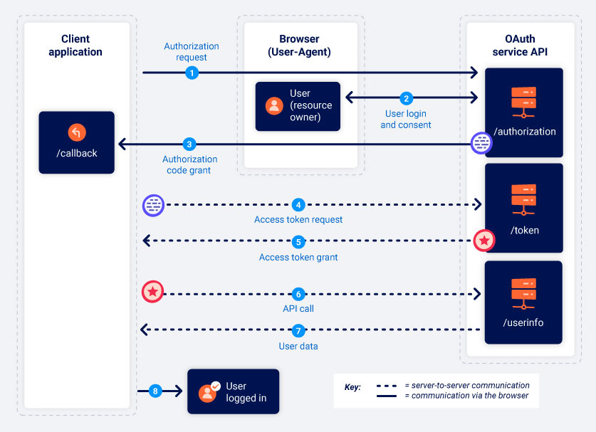
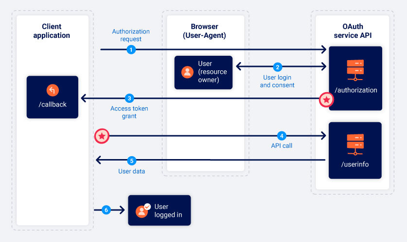

# OAuth授权类型

在本节中，我们将介绍两种最常见的OAuth授权类型的基础知识。如果你完全不熟悉 OAuth，我们建议你在尝试完成[OAuth认证](https://portswigger.net/web-security/oauth)实验前先阅读本节内容。

## 什么是OAuth授权类型？

OAuth授权类型决定了OAuth流程中所涉及的确切步骤顺序。授权类型还会影响客户端应用在每个阶段与OAuth服务通信的方式，包括访问令牌本身的发送方式。因此，授权类型通常被称为“OAuth流”（OAuth flows）。

在客户端应用初始化相应的流之前，OAuth服务必须被配置为支持特定的授权类型。客户端应用在向OAuth服务发送的初始授权请求中指定它要使用的授权类型。

有几种不同的授权类型，每一种都具有不同的复杂性和安全性考虑。我们将重点关注“授权码”（authorization code）和“隐式”（implicit）授权类型，因为它们是目前最常见的类型。

## OAuth作用域

对于任何OAuth授权类型，客户端应用都必须指定它想要访问的数据，以及它想要执行的操作类型。它通过一个参数来实现它的目的，这个参数是发送给OAuth服务的授权请求中的`scope`参数。

对于基本的OAuth，客户端应用可以请求访问的作用域（scope）对于每个OAuth服务都是唯一的。由于作用域的名称只是一个任意文本字符串，因此其格式在不同的提供者之间会有很大差异。有些甚至使用一个完整的URI作为作用域的名称，类似于REST API的端点。例如，当请求对用户联系人列表的读取访问权限时，根据所使用的OAuth服务，作用域名称可能采用以下任何一种形式：

```
scope=contacts
scope=contacts.read
scope=contact-list-r
scope=https://oauth-authorization-server.com/auth/scopes/user/contacts.readonly
```

但是，当OAuth被用于认证时，通常会使用标准化的OpenID Connect作用域。例如，`openid profile`作用域将授权客户端应用对一组预定义用户基本信息（例如他们的电子邮件地址、用户名等）的读取权限。稍后我们将详细讨论[OpenID Connect](./openid.md)。

## 授权码授权类型

授权码授权类型一开始看起来非常复杂，但一旦你熟悉了一些基础知识，它实际上比你想象的要简单。

简而言之，客户端应用和OAuth服务首先使用重定向来交换一系列基于浏览器的HTTP请求，从而启动该流。用户会被询问是否同意所请求的访问。如果他们接受，客户端应用将获得一个“授权码”。然后，客户端应用与OAuth服务交换这个代码，以获得一个“访问令牌”（access token），他们可以用它来进行API调用，以获取相关用户数据。

从代码/令牌交换开始的所有通信都是通过一个安全的、预先配置好的后方通道（back-channel<sup>[1]</sup>）在服务器与服务器之间发送的，最终用户是看不到的。这个安全通道是在客户端应用首次向OAuth服务注册时建立的。在这个时候，也会生成一个`client_secret`，客户端应用在发送这些服务器到服务器的请求时必须使用它来验证自己。

由于最敏感的数据（访问令牌和用户数据）不是通过浏览器发送的，因此这种授权类型可以说是最安全的。如果可能，服务器端应用理想情况下应始终使用此授权类型。



#### 1. 授权请求

客户端应用向OAuth服务的`/authorization`端点发送请求，要求获得访问特定用户数据的权限。请注意，不同提供商的端点映射可能有所不同，我们的实验使用`/auth`端点来实现这一目的。然而，你应该始终能够根据请求中使用的参数来确定端点。

```http
GET /authorization?client_id=12345&redirect_uri=https://client-app.com/callback&response_type=code&scope=openid%20profile&state=ae13d489bd00e3c24 HTTP/1.1
Host: oauth-authorization-server.com
```

这个请求包含以下值得注意的参数，通常在查询字符串中提供：

- `client_id`

  强制性参数，包含客户端应用的唯一标识符。这个值是在客户端应用与OAuth服务注册时产生的。

- `redirect_uri`
  
  在向客户端应用发送授权码时，用户的浏览器应该被重定向到哪个URI。这也被称为“回调URI”或“回调端点”。许多OAuth攻击都是基于利用此参数的验证缺陷而进行的。

- `response_type`

  确定客户端应用期望的响应类型，以及它想要启动的流。对于授权码授权类型，该值应为`code`。

- `scope`

  用于指定客户端应用想要访问用户数据的哪个子集。请注意，这些可能是OAuth提供商设置的自定义或OpenID Connect规范定义的标准化作用域。我们将在后面更详细地介绍[OpenID Connect](./openid.md)。

- `state`

  存储一个唯一的、不可猜测的值，该值与客户端应用的当前会话相关联。OAuth服务应在响应中返回此确切值，同时返回授权码。此参数作为客户端应用的CSRF令牌，确保对其`/callback`端点的请求是来自启动OAuth流的同一个人。

#### 2. 用户登录和同意

当授权服务器收到初始请求时，它会将用户重定向到一个登录页面，在那里用户会被提示登录到他们在OAuth提供商的帐户。这通常是他们的社交媒体帐户。

然后，他们将看到客户端应用想要访问的数据列表。这基于授权请求中定义的作用域。用户可以选择是否同意此访问。

需要注意的是，一旦用户批准了客户端应用的给定作用域，只要用户仍然与OAuth服务保持有效会话，这一步骤就会自动完成。换句话说，当用户第一次选择“使用社交媒体登录”时，他们需要手动登录并表示同意，但如果他们以后再次访问客户端应用，通常可以通过一次点击就能够重新登录。

#### 3. 授权码授权

如果用户同意所请求的访问，他们的浏览器将被重定向到授权请求中的`redirect_uri`参数里指定的`/callback`端点。由此产生的`GET`请求将包含授权码作为一个查询参数。根据配置，它也可能发送与授权请求中相同值的`state`参数。

```http
GET /callback?code=a1b2c3d4e5f6g7h8&state=ae13d489bd00e3c24 HTTP/1.1
Host: client-app.com
```

#### 4. 访问令牌请求

一旦客户端应用收到授权码，它需要将其交换成访问令牌。要做到这一点，需要向OAuth服务的`/token`端点发送一个服务器到服务器的`POST`请求。从此开始的所有的通信都是在一个安全的后方通道中进行的，因此通常攻击者无法探察或控制。

```http
POST /token HTTP/1.1
Host: oauth-authorization-server.com
…
client_id=12345&client_secret=SECRET&redirect_uri=https://client-app.com/callback&grant_type=authorization_code&code=a1b2c3d4e5f6g7h8
```

除了`client_id`和授权`code`外，你还会注意到以下新的参数：

- `client_secret`

  客户端应用必须通过包含向OAuth服务注册时分配的密钥来验证自身。

- `grant_type`

  用于确保新的端点知道客户端应用想使用的授权类型。在这种情况下，此参数应该设置为`authorization_code`。

#### 5. 访问令牌授权

OAuth服务将验证访问令牌请求。如果一切都符合预期，服务器就会响应，授权客户端应用程序一个具有所要求作用域的访问令牌。

```json
{
    "access_token": "z0y9x8w7v6u5",
    "token_type": "Bearer",
    "expires_in": 3600,
    "scope": "openid profile",
    …
}
```

#### 6. API调用

现在客户端应用有了访问码，它终于可以从资源服务器上获取用户的数据了。为此，它对OAuth服务的`/userinfo`端点进行了一个API调用。访问令牌在`Authorization: Bearer` 标头中提交，以证明客户端应用有权访问该数据。

```http
GET /userinfo HTTP/1.1
Host: oauth-resource-server.com
Authorization: Bearer z0y9x8w7v6u5
```

#### 7. 资源授权

资源服务器应验证该令牌是否有效，以及它是否属于当前客户端应用。如果是这样，它将通过发送所请求的资源，即基于访问令牌作用域的用户数据来响应。

```json
{
    "username":"carlos",
    "email":"carlos@carlos-montoya.net",
    …
}
```

客户端应用最终可以将这些数据用于其预期目的。在OAuth认证的情况下，通常用作一个ID来授权用户一个经过认证的会话，从而有效地让他们登录。

## 隐式授权类型

隐式授权类型要简单得多。客户端应用不是先获得一个授权码然后将其交换为访问令牌，而是在用户同意后立即接收访问令牌。

你可能想知道为什么客户端应用并不总使用隐式授权类型。答案比较简单——他的安全性要低得多。当使用隐式授权类型时，所有通信都是通过浏览器重定向进行的，没有像授权码流中那样的安全后方通道。这意味着敏感的访问令牌和用户数据会更多地暴露在潜在的攻击之下。

隐式授权类型更适合于单页应用和本地桌面应用，这些应用不容易在后端存储`client_secret`，因此使用授权码授予类型的好处不大。



#### 1. 授权请求

隐式流开始的方式与授权码流基本相同。唯一的主要区别是`response_type`参数必须被设置为`token`。

```http
GET /authorization?client_id=12345&redirect_uri=https://client-app.com/callback&response_type=token&scope=openid%20profile&state=ae13d489bd00e3c24 HTTP/1.1
Host: oauth-authorization-server.com
```

#### 2. 用户登录和同意

用户登录后决定是否同意所要求的权限。此过程与授权码流完全相同。

#### 3. 访问令牌授权

如果用户同意所请求的访问，这时事情就开始不同了。OAuth服务将把用户的浏览器重定向到授权请求中指定的`redirect_uri`。但是，它不会发送一个包含授权码的查询参数，而是将访问令牌和其他特定于令牌的数据作为一个URL片段发送。

```http
GET /callback#access_token=z0y9x8w7v6u5&token_type=Bearer&expires_in=5000&scope=openid%20profile&state=ae13d489bd00e3c24 HTTP/1.1
Host: client-app.com
```

由于访问令牌是在URL片段中发送的，因此它不会被直接发送到客户端应用。相反，客户端应用必须使用一个合适的脚本来提取该片段并存储它。

#### 4. API调用

一旦客户端应用成功地从URL片段中提取了访问令牌，就可以使用它来对OAuth服务的`/userinfo`端点进行API调用。与授权码流不同，单这也是通过浏览器进行的。

```http
GET /userinfo HTTP/1.1
Host: oauth-resource-server.com
Authorization: Bearer z0y9x8w7v6u5
```

#### 5. 资源授权

资源服务器应验证该令牌是否有效，以及它是否属于当前客户端应用。

如果是这样，它将通过发送所请求的资源，即基于与访问令牌关联的作用域的用户数据来进行响应。

```json
{
    "username":"carlos",
    "email":"carlos@carlos-montoya.net"
}
```

客户端应用最终可以将这些数据用于其预期目的。在OAuth认证的情况下，通常用作一个ID来授权用户一个经过认证的会话，从而有效地让他们登录。

> **阅读更多**
>
> 现在你对不同流的工作原理有了更多的了解，应该能够按照我们的学习材料，了解如何利用基于OAuth的认证机制中的漏洞。
>
> [OAuth认证漏洞](./README.md)

> 译者注：
>
> <sup>[1]</sup> back-channel，此处指的是后端server之间通信的通道。