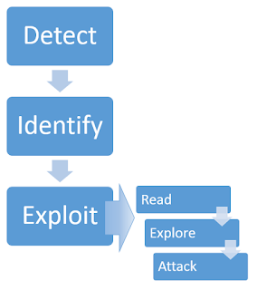

# 服务器端模板注入

这项技术最初是由PortSwigger Research在[《Server-Side Template Injection: RCE for the Modern Web App》](https://portswigger.net/research/server-side-template-injection)会议演讲中记录的。

在本节中，我们将讨论什么是服务器端模板注入，并概述利用服务器端模板注入漏洞的基本方法。我们还将建议一些方法，以确保你自己对模板的使用不会使你遭受到服务器端模板注入。

> **Labs**
>
> 如果你已经熟悉服务器端模板注入漏洞背后的基本概念，只想在一些现实的、故意易受攻击的目标上练习利用这些漏洞，你可以从以下链接中访问本主题中的所有实验。
>
> [查看所有服务器端模板注入实验](https://portswigger.net/web-security/all-labs#server-side-template-injection)

PortSwigger在我们2015年关于该主题的研究论文中首次记录了该技术。如果你对我们如何能够在实际网站上利用其中一些漏洞感兴趣，可以在我们的研究页面上找到完整的文章。

> **Research**
>
> [服务器端模板注入](https://portswigger.net/research/server-side-template-injection)

## 什么是服务器端模板注入？

服务器端模板注入是指攻击者能够使用本机模板语法将恶意有效负载注入到模板中，然后在服务器端执行该模板。

模板引擎被设计成通过将固定模板与易变数据相结合来生成Web页面。当用户的输入直接连接到模板而不是作为数据传递时，就会发生服务器端模板注入攻击。这允许攻击者能够注入任意模板指令以操纵模板引擎，通常使他们能够完全控制服务器。顾名思义，服务器端模板注入有效载荷是在服务器端交付和评估的，这可能使它们比典型的客户端模板注入更危险。

## 服务器端模板注入有什么影响？

服务器端模板注入漏洞会使网站受到各种攻击，这取决于具体的模板引擎以及应用程序使用它的方式。在某些罕见的情况下，这些漏洞不会构成真正的安全风险。然而，在大多数时候，服务器端模板注入的影响可能是灾难性的。

在严重的情况下，攻击者可能会实现远程代码执行，完全控制后端服务器，并利用它对内部基础设施进行其他攻击。

即使无法完全实现远程代码执行，攻击者通常仍然可以使用服务器端模板注入作为许多其他攻击的基础，从而可能获得对服务器上敏感数据和任意文件的读取权限。

## 服务器端模板注入漏洞是如何产生的？

当用户输入被连接到模板中而不是作为数据传入时，就会产生服务器端模板注入漏洞。

静态模板只是提供占位符，并将动态内容渲染在其中，通常不会受到服务器端模板注入攻击。典型的例子是一封以用户名字问候的邮件，例如下面这个来自Twig模板的摘录。

```java
$output = $twig->render("Dear {first_name},", array("first_name" => $user.first_name) );
```

这不易受到服务器端模板注入的影响，因为用户的名字只是作为数据传入到模板中。

然而，由于模板只是字符串，因此Web开发人员有时会在渲染之前将用户输入直接连接到模板中。让我们举一个与上面类似的例子，但是这次，用户能够在邮件发送前定制部分内容。例如，他们也许可以选择使用的名称：

```java
$output = $twig->render("Dear " . $_GET['name']);
```

在此示例中，不是将静态值传入到模板中，而是使用`name` `GET`参数动态生成模版自身的一部分。由于模板语法是在服务端评估的，这可能使攻击者在`name`参数中放置一个服务器端模板注入的payload，如下所示：

```text
http://vulnerable-website.com/?name={{bad-stuff-here}}
```

诸如此类的漏洞有时是由于不熟悉安全隐患的人对模板的不良设计而导致的。就像上面的示例一样，你可能会看到不同的组件，其中一些包含用户输入，这些用户输入已连接并嵌入到模板中。在某些方面，这类似于SQL注入漏洞发生在编写不当的预编译语句中。

然而，有时这种行为实际上是故意实施的。例如，一些网站故意允许某些有特权的用户（如内容编辑人员），通过设计来编辑或提交自定义模板。如果攻击者能够破坏具有这种权限的账户，则显然会带来巨大的安全风险。

### 构建一个服务器端模板注入攻击

识别服务器端的模板注入漏洞并制作一个成功的攻击，通常包括以下高级过程。



### 检测

服务器端模板注入漏洞通常不被注意到，不是因为它们很复杂，而是因为它们只对明确寻找它们的审计人员才真正明显。如果你能够检测到漏洞的存在，那么利用它就会变得非常容易。这在非沙箱环境中尤其如此。

与任何漏洞一样，利用漏洞的第一步是能够找到它。也许最简单的初始方法是通过注入一连串模板表达式中常用的特殊字符串（如`${{<%[%'"}}%\`），来尝试模糊测试模板。如果引发异常，则表明注入的模板语法有可能被服务器以某种方式解释。这是可能存在服务器端模板注入漏洞的一个迹象。

服务器端模板注入漏洞发生在两种不同的上下文中，每种情况下都需要有它自己的检测方法。无论你的模糊测试结果如何，都必须尝试以下特定上下文的方法，这一点很重要。如果模糊测试没有结果，那么使用这些方法中的一种，漏洞仍可能暴露出来。即使模糊测试表明存在模版注入漏洞，你仍然需要确定其上下文才能加以利用。

#### 纯文本上下文

大多数模版语言允许你自由地输入内容，要么直接使用HTML标签，要么使用模版原生语法，这些模版在HTTP响应发送之前会在后端被渲染成HTML。例如，在Freemarker中，`render('Hello ' + username)`行将呈现为类似`Hello Carlos`的内容。

有时可以将其用于XSS利用，实际上这经常被误认为是一个简单的XSS漏洞。然而，通过设置数学运算作为参数值，我们可以测试这是否也是服务器端模板注入攻击的潜在入口点。

例如，考虑一个包含以下易受攻击的代码的模板：

```java
render('Hello ' + username)
```

在审计过程中，我们可能会通过请求一个URL来测试服务器端模板注入，如：

```
http://vulnerable-website.com/?username=${7*7}
```

如果输出结果包含`Hello 49`，则表明数学运算在服务器端被评估。这是一个很好的服务器端模板注入漏洞的概念证明更详细地讨论这个问题。

请注意，成功评估数学运算所需的具体语法将根据所使用的模板引擎而有所不同。我们将在识别步骤中。

#### 代码上下文

在其他情况下，漏洞是通过将用户输入放置在模板表达式中来暴露的，就像我们前面看到的电子邮件示例一样。这可能采取的形式是将用户可控的变量名称放置在一个参数中，例如：

```java
greeting = getQueryParameter('greeting')
engine.render("Hello {{"+greeting+"}}", data)
```

在网站上，产生的URL将类似于：

```text
http://vulnerable-website.com/?greeting=data.username
```

这将在输出中渲染为`Hello Carlos`。

这种情况在评估过程中很容易被忽略，因为它不会导致明显的XSS，并且与简单的hashmap查询几乎没有什么区别。在这种情况下，测试服务器端模板注入的一种方法是，首先通过将任意的HTML注入到值中来确定该参数不包含直接的XSS漏洞。

```html
http://vulnerable-website.com/?greeting=data.username<tag>
```

在没有XSS的情况下，通常会导致输出中出现一个空白条目（只有`Hello`，没有用户名），编码标签或错误信息。下一步是尝试使用常见的模版语法突破该语句，并尝试在其之后注入任意的HTML。

```html
http://vulnerable-website.com/?greeting=data.username}}<tag>
```

如果这再次导致了错误或空白输出，则说明要么你使用了错误的模版语言的语法，要么如果没有模版风格的语法有效，那么服务器端模版注入就是不可能的。或者，如果输出和任意的HTML一起被正确渲染，这是一个关键的迹象，表明存在服务器端模板注入漏洞。

```html
Hello Carlos<tag>
```

### 识别

一旦你检测到模板注入的可能性，下一步就是识别模板引擎。

尽管有大量的模板语言，但许多模板语言使用非常相似的语法，这些语法是专门选择不与HTML字符冲突。因此，创建探测payload以测试正在使用的模板引擎是相对简单的。

通常只需提交无效的语法即可，因为产生的错误信息将准确告诉你模板引擎是什么，有时甚至包含版本信息。例如，无效表达式`<%=foobar%>`会触发基于Ruby的ERB引擎返回以下响应：

```ruby
(erb):1:in `<main>': undefined local variable or method `foobar' for main:Object (NameError)
from /usr/lib/ruby/2.5.0/erb.rb:876:in `eval'
from /usr/lib/ruby/2.5.0/erb.rb:876:in `result'
from -e:4:in `<main>'
```

否则，你将需要手动测试特定语言的不同payload并研究模板引擎如何解释它们。使用基于语法有效或无效的排除过程，可以比你想象的更快地缩小选择范围。一种常见的方法是使用来自不同模板引擎的语法注入任意数学运算。然后观察它们是否被成功评估。为帮助完成此过程，你可以使用一个类似于下面的决策树：


你应该意识到，相同的payload有时可能会在多个模板语言中返回一个成功的响应。例如，`{{7*'7'}}` payload在Twig中返回`49`，在Jinja2中返回`7777777`。因此，重要的是不要根据一个成功的响应就仓促下结论。

### 利用

在检测到存在潜在漏洞并成功识别模板引擎之后，你可以开始尝试找到利用它的方法。

> **阅读更多**
>
> [利用服务器端模板注入漏洞](./exploiting.md)

## 如何防止服务器端模板注入漏洞

防止服务器端模板注入的最佳方法是不允许任何用户修改或提交新模板。然而，由于业务需求，有时这是不可避免的。

避免引入服务器端模板注入漏洞的最简单方法之一是，除非绝对必要，否则始终使用“logic-less”模板引擎，例如Mustache。尽可能将逻辑与表示分离开来，可以大大减少你遭受最危险的基于模板的攻击的风险。

另一个措施是只在沙箱环境中执行用户的代码，在这个环境中，潜在的危险模块和功能已经被完全删除。不幸的是，对不受信任的代码进行沙箱处理本身就很困难，而且容易被绕过。

最后，另一种补充方法是接受几乎不可避免的任意代码执行，并通过在锁定的Docker容器中部署模板环境来应用自己的沙箱。